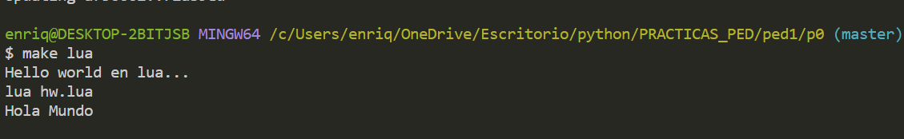

# NOTAS PARA LOS USUARIOS #

El proyecto consiste en implementar un "hola mundo" utilizando el lenguaje de programación imperativo LUA.
Elegimos este lenguaje ya que se usa para desarrollar videojuegos.

Ejemplo de ejecución:

